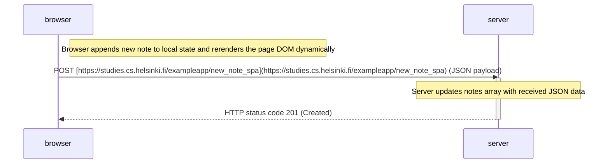

```mermaid
sequenceDiagram
    participant browser
    participant server

    Note right of browser: Browser appends new note to local state and rerenders the page DOM dynamically

    browser->>server: POST [https://studies.cs.helsinki.fi/exampleapp/new_note_spa](https://studies.cs.helsinki.fi/exampleapp/new_note_spa) (JSON payload)
    activate server
    Note over server: Server updates notes array with received JSON data
    server-->>browser: HTTP status code 201 (Created)
    deactivate server
```
